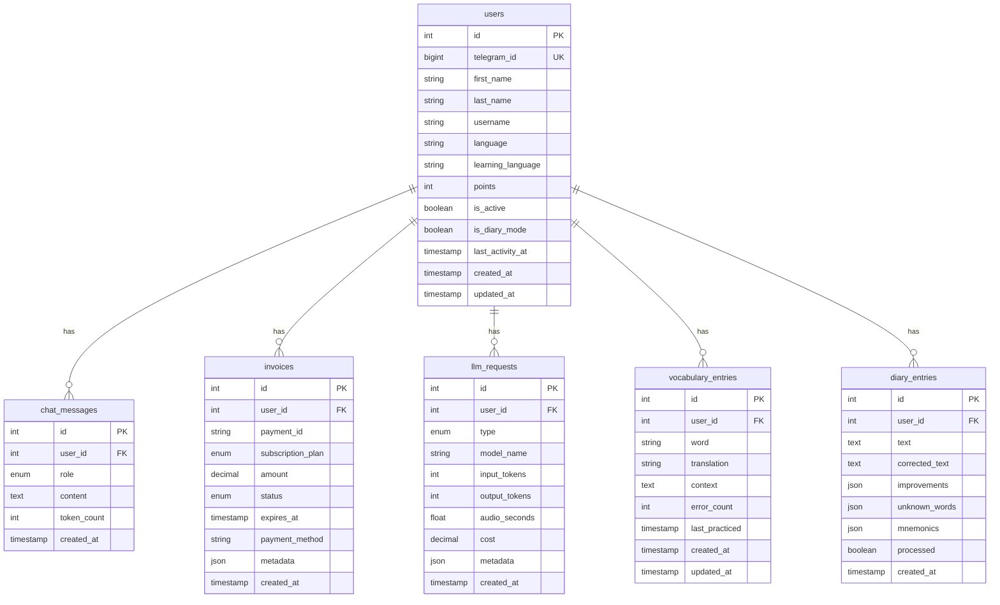

# TanulBot Database Schema

Below is a diagram of the TanulBot database schema:

## Tables Explanation

### users

Stores user information, preferences, and learning progress.

### chat_messages

Stores chat history between users and the bot.

### invoices

Records subscription and payment information for users.

### llm_requests

Tracks usage of Large Language Model APIs, including tokens and costs.

### vocabulary_entries

Stores vocabulary words that users are learning, with learning progress.

### diary_entries

Stores user diary entries and their AI-corrected versions.
